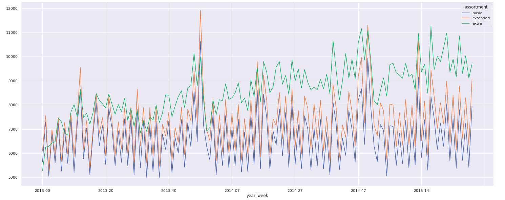

# Rossmann Sales Prediction

<strong>Disclaimer</strong>: this project was based on the &quot;Rossmann Store Sales&quot; challenge published on <a href="https://www.kaggle.com/c/rossmann-store-sales">Kaggle</a>. It is a fictitious project. However; the steps followed to solve the business problem are the same applied to real projects.

<h1 dir="auto">Business problem</h1>

The CFO of Rossmann Drug Stores requested a sales prediction for each store for the next six weeks in order to define a budget for stores refurbishment. The resources would be allocated according to each store's sales prediction. The current prediction is not satisfactory as there are several inconsistencies. 

<h3 dir="auto">Solution Proposal</h3>

In this context, I developed a machine learning model in order to provide a more accurate store sale forecast.

<h1 dir="auto">Dataset Summary</h1>

The dataset provides historical sales data for 1,115 Rossmann stores. The dataset is available on <a href="https://www.kaggle.com/c/rossmann-store-sales">Kaggle</a>.

<table style="width: 100%;">
    <tbody>
        <tr>
            <td style="width: 39.0229%;">
                
<strong>Attribute</strong>

            </td>
            <td style="width: 60.9771%;">
                
<strong>Description</strong>

            </td>
        </tr>
        <tr>
            <td style="width: 39.0229%; vertical-align: bottom;">Id</td>
            <td style="width: 60.9771%;">An Id that represents a (Store, Date) duple within the test set</td>
        </tr>
        <tr>
            <td style="width: 39.0229%; text-align: left; vertical-align: bottom;">Store</td>
            <td style="width: 60.9771%;">A unique Id for each store</td>
        </tr>
        <tr>
            <td style="width: 39.0229%; vertical-align: bottom;">Sales </td>
            <td style="width: 60.9771%;">The turnover for any given day (this is what you are predicting) </td>
        </tr>
        <tr>
            <td style="width: 39.0229%; vertical-align: bottom;">Customers </td>
            <td style="width: 60.9771%;">The number of customers on a given day </td>
        </tr>
        <tr>
            <td style="width: 39.0229%; vertical-align: bottom;">Open </td>
            <td style="width: 60.9771%;">An indicator for whether the store was open: 0 = closed, 1 = open </td>
        </tr>
        <tr>
            <td style="width: 39.0229%; vertical-align: bottom;">StateHoliday </td>
            <td style="width: 60.9771%;">Indicates a state holiday. Normally all stores, with few exceptions, are closed on state holidays. Note that all schools are closed on public holidays and weekends. a = public holiday, b = Easter holiday, c = Christmas, 0 = None </td>
        </tr>
        <tr>
            <td style="width: 39.0229%; vertical-align: bottom;">SchoolHoliday </td>
            <td style="width: 60.9771%;">Indicates if the (Store, Date) was affected by the closure of public schools </td>
        </tr>
        <tr>
            <td style="width: 39.0229%;vertical-align: bottom;">StoreType </td>
            <td style="width: 60.9771%;">Differentiates between 4 different store models: a, b, c, d </td>
        </tr>
        <tr>
            <td style="width: 39.0229%;vertical-align: bottom;">Assortment </td>
            <td style="width: 60.9771%;">Describes an assortment level: a = basic, b = extra, c = extended </td>
        </tr>
        <tr>
            <td style="width: 39.0229%;vertical-align: bottom;">CompetitionDistance </td>
            <td style="width: 60.9771%;">Distance in meters to the nearest competitor store </td>
        </tr>
        <tr>
            <td style="width: 39.0229%;vertical-align: bottom;">CompetitionOpenSince[Month/Year] </td>
            <td style="width: 60.9771%;">Gives the approximate year and month of the time the nearest competitor was opened </td>
        </tr>
        <tr>
            <td style="width: 39.0229%;vertical-align: bottom;">Promo </td>
            <td style="width: 60.9771%;">Indicates whether a store is running a promo on that day </td>
        </tr>
        <tr>
            <td style="width: 39.0229%;vertical-align: bottom;">Promo2 </td>
            <td style="width: 60.9771%;">Promo2 is a continuing and consecutive promotion for some stores: 0 = store is not participating, 1 = store is participating </td>
        </tr>
        <tr>
            <td style="width: 39.0229%;vertical-align: bottom;">Promo2Since[Year/Week] </td>
            <td style="width: 60.9771%;">Describes the year and calendar week when the store started participating in Promo2 </td>
        </tr>
        <tr>
            <td style="width: 39.0229%;vertical-align: bottom;">PromoInterval </td>
            <td style="width: 60.9771%;">Describes the consecutive intervals Promo2 is started, naming the months the promotion is started anew. E.g. &quot;Feb,May,Aug,Nov&quot; means each round starts in February, May, August, November of any given year for that store </td>
        </tr>
    </tbody>
</table>

<h1 dir="auto">Business Assumptions</h1>
<ul dir="auto">
    <li>The days the stores were closed were removed from the analysis.</li>
    <li>Only stores with sales values bigger than 0 were considered.</li>
    <li>For stores that did not have Competition Distance information, it was considered that the distance should be 200,000 - higher than the longest distance observed in the data set. This assumption represents that the closest competitor might be too far to computethere, or there is no competition at all. </li>
</ul>

<h1 dir="auto">Solution methodology</h1>

The solution was developed based on the CRISP (CRoss-Industry Standard Process for data mining) methodology, which is a cyclical approach that streamlines the delivery of value.

Source: <a href="https://commons.wikimedia.org/wiki/File:CRISP-DM_Process_Diagram.png">Wikimedia</a>&nbsp;

<strong>Step 01</strong>. <strong>Data Description:</strong> Using statistical metrics to identify outliers in the business scope and also analyze basic statistical metrics such as: mean, median, maximum, minimum, range, skew, curtosis and standard deviation.

<strong>Step 02</strong>. <strong>Feature Engineering</strong>: Obtaining new attributes based on the original variables, in order to better describe the phenomenon to be modeled.

<strong>Step 03</strong>. <strong>Data Filtering</strong>: Filtering rows and delete columns that are not relevant for the model or are not part of the business scope.

<strong>Step 04</strong>. <strong>Exploratory Data Analysis</strong>: Exploring the data to find insights and better understand the impact of variables on model learning.

<strong>Step 05</strong>. <strong>Data Preparation</strong>: Preparing the data for the machine learning application.

<strong>Step 06</strong>. <strong>Feature Selection</strong>: Selecting the best attributes to train the model. It was used Boruta Algorithm to make the selection.

<strong>Step 07</strong>. <strong>Machine Learning Modeling</strong>: Training the Machine learning model.

<strong>Step 08</strong>. <strong>Hyperparameter Fine Tunning</strong>: Choosing the best values for each of the parameters of the model selected in the previous step.

<strong>Step 09</strong>. <strong>Convert model performance to business values</strong>: Converting model performance to a business result.

<strong>Step 10</strong>. <strong>Deploy Model to Production</strong>: Publishing the model in a cloud environment so that other people or services can use the results to improve the business decision. The cloud application platform choosed was Heroku.

<strong>Step 11</strong>. <strong>Telegram Bot</strong>: Creating a bot on the telegram app, that make possible to consult the forecast at any time.

<h1 dir="auto">Hypotheses Mind Map </h1>

A Mind Map was created to generate hypothesis that would turn into insights during the Exploratory Data Analysis.

 

<ol dir="auto">

<strong>H1.</strong> Stores with a bigger product assortment are more likely to sell more daily

<strong>H2.</strong> Stores with closer competitors are more likely to sell less

<strong>H3.</strong> Stores with longer-standing competitors are more likely sell more

<strong>H4.</strong> Products on sales during a long period of time are more likely to sell more daily

<strong>H5.</strong> Stores with more extended promotions are more likely to sell more

<strong>H6.</strong> Sales are more likely to increase during holiday season (Christmas)

<strong>H7.</strong> Stores are more likely to sell more over the years

<strong>H8.</strong> Stores are more likely to sell more in the second half of the year

<strong>H9.</strong> Stores are more likely to sell more after the 10th day of each month

<strong>H10.</strong> Stores are more likely to sell less on weekends

<strong>H11.</strong> Stores are more likely to sell less during school holidays

</ol>

Please find the summary of the analysis of hypotheses 1, 2, 5. Refer to the notebook file for the complete Exploratory Data Analysis. 

<h1 dir="auto">Top Three Data Insights </h1>

<strong>H1.</strong> **Stores with a bigger product assortment are more likely to sell more daily**

**True**: Stores with a bigger product assortment are more likely to sell more

 

Stores with extra assortment have a better performance when comparing the average sales over time between all story types.

 

<strong>H2.</strong> **Stores with closer competitors are more likely to sell less**

**False**: The distance from competitors does not influence store sales.

Notice that sales do not increase as the nearest competitor distance grow. Sales seem to be independent of competition distance, which can be considered an insight. Competitor does not impact the business negatively, contradicting the common belief.

 

<strong>H5.</strong> **Stores with more extended promotions are more likely to sell more**

**False**: Stores that applied promo2 followed by promo1 performed worse on average when compared to stores that applied only the promo1.

Historically, following this approach do not work in terms of generating more sales.

<h1 dir="auto">Tested Machine Learning Models</h1>
<ul dir="auto">
    <li>Average Model (Baseline)</li>
    <li>Linear Regression Model</li>
    <li>Linear Regression Regularized Model (Lasso)</li>
    <li>Random Forest Regressor</li>
    <li>XGBoost Regressor</li>
</ul>

<h1 dir="auto">Machine Learning Models Performance</h1>

The metrics applied to measure the performance of the algorithms were MAE, MAPE and RMSE.

<h1 dir="auto">Hyperparemeter Fine Tuning</h1>

<h1 dir="auto">Business Performance</h1>
